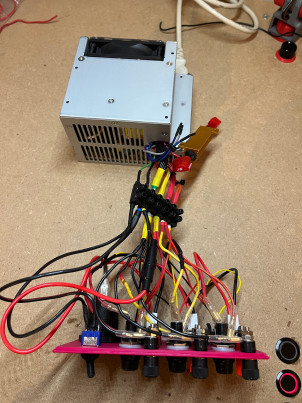

# Lab Power Supply

## Overview

The goal is to create an inexpensive laboratory power supply with stable voltage and medium/high current output. I will use an old but working power supply, the _API2PC23_ from IBM. Due to its peculiar shape, the 3D files I created might not be suited for every power supplies but can be easily adapted.   

## Bill of  materials
| Name             | N°  | Link                                                      | Price (€) | Desc.                          |
|------------------|:---:|-----------------------------------------------------------|:---------:|--------------------------------|
| ATX PSU          | 1   |                                                           |           | Recycled power supply          |
| Load Resistor    | 1   | [Link](https://aliexpress.com/item/1005002006427812.html) | $\sim 3$  | 50W 6 $$\Omega$$  Load Resistor|
| Button           | 1   | [Link](https://aliexpress.com/item/32840360301.html)      | $\sim 2$  | Buttons + caps                 |
| Display          | 3   | [Link](https://aliexpress.com/item/1005006160585749.html) | $\sim 5$  | Display for voltage & current  |
| Banana plug      | 3x2 | [Link](https://aliexpress.com/item/1005005988853903.html) | $\sim 2$  | Banana plugs (link for 10)     |
| Fuse holder      | 3   | [Link](https://aliexpress.com/item/4000126701820.html)    | $\sim 2.5$| (link for 10)                  |
| Fuse             | 3   | [Link](https://aliexpress.com/item/1005004114014014.html) | $\sim 4$  | 3x10A $\quad $(link for batch) |
| USB port         | 1   | [Link](https://aliexpress.com/item/1005004550370249.html) | $\sim 7$  | 60W USB C (PD) + A (QC 3.0)|

__Total price__ : $\ \sim 25.5\ €$

I also suggest using connectors such as :
- [Type 1](https://aliexpress.com/item/1005005196465737.html)
- [Type 2](https://aliexpress.com/item/1005005283085015.html)    

The type 2 will be especially usefull for connecting to the banana plugs and fuse holder.

## Schematics

I made schematics for this project : [here](Schematics/Schematics.pdf)    

## 3D files

You can find the 3D step files I made in the Hardware folder. Please feel free to use them directly or adapt them to the power supply you are using.    
I printed the whole housing in "Ruby red" PLA, it took around 9h total with a .3mm layer height.

## Step 1 
The first step is to divide the cables comming out of the power supply depending on their voltage output. The colors are usually standardized but I would still recommand checking with a multimeter.    

- Used cables :
    - Black &emsp; &emsp; &rarr; &emsp; GND
    - Yellow &emsp; &ensp; &rarr; &emsp; +12V
    - Red &emsp; &emsp; &nbsp; &rarr; &emsp; +5V
    - Orange &ensp; &nbsp;&nbsp; &rarr; &emsp; +3.3V
    - Green &emsp;&emsp; &rarr; &emsp; Power on/off

- Unused cables :
    - White &emsp; &ensp; &rarr; &emsp; -5V
    - Purple &emsp; &ensp; &rarr; &emsp; +5VSB
    - Grey &emsp; &emsp;  &rarr; &emsp; PG
    - Blue &emsp; &ensp; &nbsp; &rarr; &emsp; -12V
    - Green &emsp;&emsp; &rarr; &emsp; Power on/off

| :zap:        Do not open the power supply ! It can be dangerous ! |
|-------------------------------------------------------------------|

I also added the load resistor between +5V and GND.

Every pack of wire will be connected together.

## Step 2

Prepare the different cables. I used the type 2 connectors with a pair of pliers adapted for those and simply connected the cables to the tabs on the banana plugs and fuse holders.

To connect the display a recommend following the schematics. For this I soldered the wires together with the provided connectors. 
If the wires are not the same as the one I used, please refer to the documentation of your display to avoid damaging it.
Furthermore, I connected all the displays to the +5V as a main power supply as the +3.3V would not have been enough to power them.     
To turn on the power supply, the green wire (POWER_ON/OFF) needs to be shorted to GND, hence the button.

## Step 3
Once everything is prepared and the housing 3d printed, it is assembly time !

(Do not refer to the picture for wiring)

I then glued the front panel to the rest of the build. If you don't have clamps you can use rubber bands to hold everything in place while the glue dries. 

## Step 4
Enjoy the final product !

## Additionnal features

I plan to upgrade this power supply in the future with :
- Elements on the sides to hold wires that can connect to the power supply and the main cable
- Make a small dependency that can connect on the +12V with a boost converter and could ouptut any tension between +5V (?) and +24V (?)
